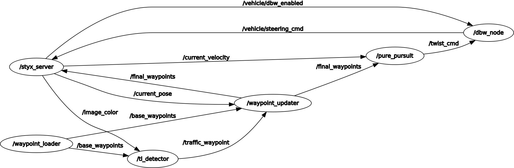
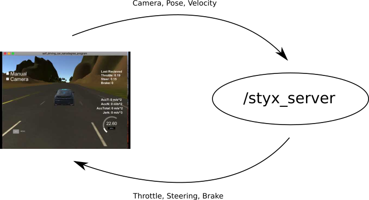
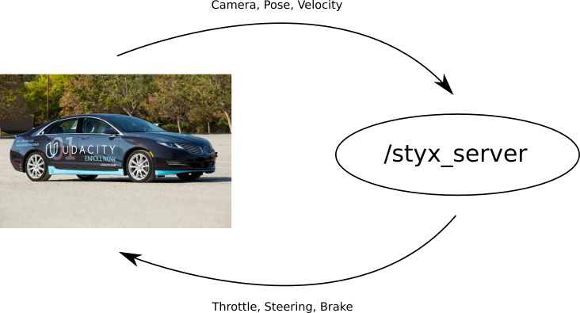

# Self-Driving Car Engineer Nanodegree Program
# *CarND-Capstone: Programming a real Self-Driving Car*
## Project-Group: The Imaginative

### Project Team Members of "The Imaginative" 
|  Name                                   | Udacity Account Email Address     |
|:---------------------------------------:|:---------------------------------:|
| Ralf Goettsche                          |   ralf.goettsche@gmail.com        |
| Sergey Moshnikov                        |   s.moshnikov@gmail.com           |
| Andrew Scott                            |   drewscott65@gmail.com           |
| Sebastian Rogawski                      |   sebastian.rogawski@gmail.com    |
| Vladimir Todorov                        |   vladimir.mailhost@gmail.com     |

## Abstract
The student group "The Imaginative" implemented Robot Operating System (ROS) nodes to control a real autonomous vehicle. The ROS nodes represent core functionalities like traffic light detection, control, and waypoint following. They were tested on a simulator, first, before they got integrated into the car system, and got tested.

## Setup

### ROS System Diagram

The following diagram shows the setup of the ROS used in this project:


The nodes ```/waypoint_loader``` , ```styx_server```, and ```pure_pursuit``` are given by Udacity. They do not need to be adapted. The rest of the nodes ( ```/waypoint_updater```, ```/dbw_node```, and ```tl_detector```) are implemented by the project team and will be discusssed later in this document. 

In our setup the Udacity simulator is connected to the ```/styx_server``` node via a bridge implemented in ```ros/src/styx/bridge.py```. It transfers sensor inputs (e.g. camera images and pose) to the ROS system and control signals (e.g. throttle, brake, and steering) from the ROS system to the simulator.

The following figure illustrates the connection between the simualtor and the ROS system:



A similar connection is built between the ROS system and the Carla car once when the software is used on a real self-driving car:




For the real testing, the simualtor will be replaced by the real Carla car from Udacity.

### ROS Nodes

- Waypoint Updater (```/waypoint_updater```)

The waypoint updater used in the project is build according to the instruction from the project walktrough. Our implementation of the waypoint updater uses a frequecy of 10Hz (10 updates per second). The number of points provided per update is 50. All the points are annotated with the desired speed limit (max. velocity of the car). Our team has determined that reducing the update frequency and the amount of points delivered to the other modules increases the performance of teh ROS system.

In case of a red taffic light ahead, the waypoint updater node computes the appropriate number of points leading to the stop line position of the corresponding traffic light. Moreover, the speed is gradually reduced so that the car smoothly transitions to a full stop.

- Drive-by-Wire (```/dbw_node```)

The drive-by-wire node utilizes a PID controller for the throttle control of the vehicle, the provided yaw controller to determine the yaw of the vehicle, and a separate brake controller to determine the deceleration force. The brake controller takes into consideration the vehicle mass, the wheel radius, as well as the brake_deadband. Although from performance point of view 50Hz might be an overshoot, this node needs to operate at this frequency. This is done in order to supply enough updates to the car and the automatic shutdown of the drive-by-wire option.  


- Traffic Light Classifation (```/tl_detector```)

This node is responsible for classifying traffic light states from the images coming from the simulator/car camera. Our team has implemented a SSD model to both determine the location of the traffic light within an image and to infer the state of the traffic light ('Green','Yellow','Red','Unknown'). The car only stops at red traffic lights. Our model has been trained on a mixture of simulator and real world data. The annotated dataset has been obtained from [here](https://www.dropbox.com/s/vaniv8eqna89r20/alex-lechner-udacity-traffic-light-dataset.zip?dl=0)

One of the biggest challenges was to get the traffic light classification model to execute within a reasonable time. Having it execute slowly (approx. 1s per image) led to the ROS reacting to an already 'outdated' state. This cause wrong behavior of the car in the simulator. 

## Challenges
### Simulator Lag

In the beginning of the project, may of our team members experienced a significant lag when running the Udacity simulator. This caused the ROS control signals to be delayed, leading to growing oscillations and overall inability of the car to follow the waypoints on the road. We remedied this problem by reducing the frequencies of the publishers as suggested [here](https://github.com/amakurin/CarND-Capstone/commit/9809bc60d51c06174f8c8bfe6c40c88ec1c39d50). We were pointed to this solution by a teaching assistant at Udacity - Deborah Gertrude.

These tips allowed some of the team members to be able to run the simulation and the ROS in parallel and to track the interaction between them. However, the setup was only working while the simulator camera was switched off. Once the camera images were enabled, the system became again laggy and, thus, uncontrollable. This issue was prominent on the setup of team members with slightly older hardware.

The final challenge was the performance of the traffic classification. In order to operate the car/simulation in a reasonable manner, the ROS system requires a relatively fast classifier. However, it is very hard to determine if the model that we run on our available hardware resources is slow because of its design or because of the insufficient performance of the available hardware. The project description  gives a description of the hardware available on Carla, but it doesn't state if these are the minimum requirements for the project to run smoothly. 


---

# **Original Udacity README**


This is the project repo for the final project of the Udacity Self-Driving Car Nanodegree: Programming a Real Self-Driving Car. For more information about the project, see the project introduction [here](https://classroom.udacity.com/nanodegrees/nd013/parts/6047fe34-d93c-4f50-8336-b70ef10cb4b2/modules/e1a23b06-329a-4684-a717-ad476f0d8dff/lessons/462c933d-9f24-42d3-8bdc-a08a5fc866e4/concepts/5ab4b122-83e6-436d-850f-9f4d26627fd9).

Please use **one** of the two installation options, either native **or** docker installation.

### Native Installation

* Be sure that your workstation is running Ubuntu 16.04 Xenial Xerus or Ubuntu 14.04 Trusty Tahir. [Ubuntu downloads can be found here](https://www.ubuntu.com/download/desktop).
* If using a Virtual Machine to install Ubuntu, use the following configuration as minimum:
  * 2 CPU
  * 2 GB system memory
  * 25 GB of free hard drive space

  The Udacity provided virtual machine has ROS and Dataspeed DBW already installed, so you can skip the next two steps if you are using this.

* Follow these instructions to install ROS
  * [ROS Kinetic](http://wiki.ros.org/kinetic/Installation/Ubuntu) if you have Ubuntu 16.04.
  * [ROS Indigo](http://wiki.ros.org/indigo/Installation/Ubuntu) if you have Ubuntu 14.04.
* [Dataspeed DBW](https://bitbucket.org/DataspeedInc/dbw_mkz_ros)
  * Use this option to install the SDK on a workstation that already has ROS installed: [One Line SDK Install (binary)](https://bitbucket.org/DataspeedInc/dbw_mkz_ros/src/81e63fcc335d7b64139d7482017d6a97b405e250/ROS_SETUP.md?fileviewer=file-view-default)
* Download the [Udacity Simulator](https://github.com/udacity/CarND-Capstone/releases).

### Docker Installation
[Install Docker](https://docs.docker.com/engine/installation/)

Build the docker container
```bash
docker build . -t capstone
```

Run the docker file
```bash
docker run -p 4567:4567 -v $PWD:/capstone -v /tmp/log:/root/.ros/ --rm -it capstone
```

### Port Forwarding
To set up port forwarding, please refer to the [instructions from term 2](https://classroom.udacity.com/nanodegrees/nd013/parts/40f38239-66b6-46ec-ae68-03afd8a601c8/modules/0949fca6-b379-42af-a919-ee50aa304e6a/lessons/f758c44c-5e40-4e01-93b5-1a82aa4e044f/concepts/16cf4a78-4fc7-49e1-8621-3450ca938b77)

### Usage

1. Clone the project repository
```bash
git clone https://github.com/udacity/CarND-Capstone.git
```

2. Install python dependencies
```bash
cd CarND-Capstone
pip install -r requirements.txt
```
3. Make and run styx
```bash
cd ros
catkin_make
source devel/setup.sh
roslaunch launch/styx.launch
```
4. Run the simulator

### Real world testing
1. Download [training bag](https://s3-us-west-1.amazonaws.com/udacity-selfdrivingcar/traffic_light_bag_file.zip) that was recorded on the Udacity self-driving car.
2. Unzip the file
```bash
unzip traffic_light_bag_file.zip
```
3. Play the bag file
```bash
rosbag play -l traffic_light_bag_file/traffic_light_training.bag
```
4. Launch your project in site mode
```bash
cd CarND-Capstone/ros
roslaunch launch/site.launch
```
5. Confirm that traffic light detection works on real life images
